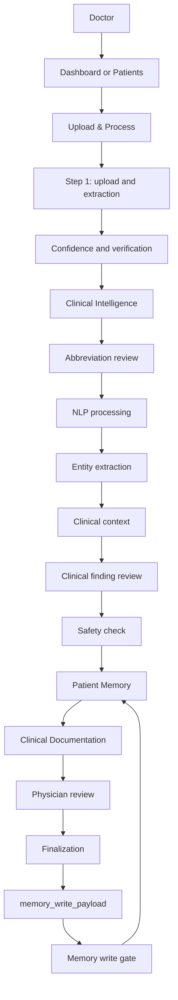

# MedFlow AI Frontend — Backend Integration Guide

Contract-first integration guide for the physician-facing MedFlow AI frontend.

This document is an integration handbook, developer onboarding guide, API adapter guide, and workflow/decision guide. It describes the repository as it exists today. It deliberately separates verified frontend behavior from backend integration targets that still need to be confirmed against the backend's authoritative OpenAPI/JSON contract.

## Source-of-truth and contract status

The backend API contract is frozen at the integration boundary:

- Frontend developers consume the backend contract.
- Backend developers implement the backend contract.
- `patient_id` stays `patient_id`; `encounter_id` stays `encounter_id`; contract fields are not casually renamed to frontend-style alternatives such as `patientId` or `encounterId`.
- If a contract change is necessary, it must be reviewed, versioned, coordinated, and communicated to both teams.
- Frontend adapters, selectors, and view models may reshape data for presentation, but backend-facing request and response structures remain unchanged.

### Important repository finding

This repository currently contains:

- TypeScript contract definitions in [`src/contracts/`](src/contracts/).
- Fixture data in [`src/mocks/`](src/mocks/).
- Promise-returning mock adapters in [`src/api/`](src/api/).
- No `fetch`, Axios client, generated API client, OpenAPI file, Swagger file, backend service, or declared API base URL.

The endpoint paths listed later in this README come from the supplied integration brief only. They are **candidate integration targets**, not verified backend paths. No authoritative backend contract was present in this repository, so this README does not claim that those paths are implemented or final. Replace the candidate path/method values with the backend's actual contract when it is available.

## 1. What this repository is

This repository contains the React + TypeScript + Vite physician-facing frontend for MedFlow AI.

The frontend currently provides:

- Physician workspace and dashboard.
- Clinical document upload and modality selection.
- Confidence and review workflows.
- Clinical intelligence review.
- Abbreviation interpretation review.
- Clinical finding review.
- Patient memory search and longitudinal timeline views.
- Verified and unverified information separation.
- Conflict review and trust-tier decisions.
- Clinical document generation, review, finalization, and history.
- Provenance drawers and audit visibility.

The backend is expected to provide the services behind that UI:

- FastAPI HTTP services.
- Authentication and authorization.
- OCR/VLM and multilingual processing where applicable.
- AI/NLP clinical event processing.
- Memory persistence and append-only event handling.
- Conflict detection and resolution.
- Clinical document generation and validation.
- Database access.
- Background processing and job status.

Those backend services are not implemented in this frontend repository. The current UI simulates them with fixtures so that workflows, contract-shaped data, and tests can run locally.

### Responsibility split

| Area | Frontend responsibility | Backend responsibility |
| --- | --- | --- |
| Navigation and layout | Render physician workspace, permanent navigation, route transitions, loading states | N/A |
| Upload UI | Collect patient/encounter identifiers, modality, language, and selected filename; invoke adapter | Define upload encoding, persist binary/document metadata, authenticate, enqueue processing |
| Step 1 extraction | Render `Step1Output`, confidence, risk, review queue, and verification actions | OCR/VLM/translation, extraction, confidence, processing status, durable verification |
| Step 2 clinical intelligence | Render the abbreviation gate, automatic NLP processing state, `ClinicalEvent[]`, provenance, finding decisions, and safety gate | Clinical NLP, normalization, entity/relationship validation, provenance, job state |
| Step 3 memory | Render verified/unverified context, timeline, conflicts, trust tiers, and physician actions | Memory persistence, retrieval, thread matching, conflict detection, append-only history |
| Step 4 documentation | Assemble typed request, render `GeneratedDocument`, expose review/edit/regenerate/finalize controls | Generate/validate documents, preserve provenance, return finalization result and memory payload |
| Safety decisions | Disable or gate actions in the UI and communicate why | Enforce authorization and safety invariants server-side; never rely on UI-only gating |
| Errors | Render adapter errors and safe retry affordances | Return the agreed `ApiError` shape, trace IDs, authorization errors, and durable failure status |
| Identity | Current fixture uses `phy_04` | Authenticate the physician and supply the authoritative physician identity |

## 2. Product workflow

The permanent physician navigation is intentionally small:

- Dashboard — `/`
- Patients — `/patients`
- Upload & Process — `/upload`
- Patient Memory — `/memory`

Clinical Intelligence is a workflow stage, not a permanent sidebar destination. Its route is `/clinical-nlp`, and it is reached from the upload handoff. Conflict review is contextual: it is shown inside Patient Memory and can also be opened at `/conflicts` with patient and encounter query parameters.

Patient Memory contains four primary views:

- Patient memory.
- Patient timeline.
- Verified information.
- Unverified information.

The documentation workspace is implemented at `/documentation`, `/documentation/review`, and `/documents`, but it is not currently a permanent sidebar item. Those routes can be linked from a future workflow shell or opened directly while the integration is being completed.

### End-to-end workflow



### UI workflow state

The shared workflow state is defined in [`src/context/WorkflowContext.tsx`](src/context/WorkflowContext.tsx). Its backend-facing identifiers and status values are snake_case and should remain so:

```ts
interface WorkflowState {
  patient_id: string
  encounter_id: string
  document_id: string
  processing_status: ProcessingStatus
  current_stage: WorkflowStage
  abbreviation_review_status: 'pending' | 'complete'
  nlp_status: 'pending' | 'processing' | 'complete' | 'failed'
  clinical_finding_review_status: 'pending' | 'complete'
  safety_status: 'blocked' | 'ready'
}
```

The ordered workflow stages are:

```text
upload
extraction
confidence
verification
clinical-intelligence
abbreviation-review
nlp-processing
entity-extraction
clinical-context
finding-review
safety-check
patient-memory
```

After a successful upload, the upload page calls `beginProcessing(...)`, stores the returned identifiers/status in the provider, and navigates to `/clinical-nlp` with the workflow state in React Router location state. Clinical Intelligence first requires local abbreviation resolution, then automatically starts the existing Step 2 processing hook. The page records `nlp_status` and only reveals findings after processing completes. Patient Memory remains unavailable until finding review and safety conditions are satisfied.

The route state is presentation/workflow state, not a replacement for server state. The backend must still validate every patient, encounter, document, job, physician, trust-tier, and memory-write relationship.

## 3. Step-by-step data flow

The intended data flow is:

```text
Upload
  → UploadDocumentResponse
  → Step1Output
  → Abbreviation review gate
  → NLP processing
  → Step2Response / ClinicalEvent[]
  → RetrievedContext / MemoryFact[]
  → GeneratedDocument
  → FinalizationResponse
  → memory_write_payload
  → MemoryWriteResponse
```

The current frontend mapping is below.

| Handoff | Source | Destination | Current frontend page | Current hook/API function | Input | Output | Current UI behavior | Current error behavior |
| --- | --- | --- | --- | --- | --- | --- | --- | --- |
| Upload → Step 1 | Upload form and selected modality | Step 1 job/document | `/upload` | `uploadTypedDocument`, `uploadHandwrittenDocument`, `uploadMultilingualInput` from `src/api/step1.ts` | `UploadDocumentRequest` | `UploadDocumentResponse` | On success, invalidates Step 1 output, updates workflow, navigates to `/clinical-nlp` | Mutation error shows “Unable to start processing. Try again.” |
| Step 1 output → verification | Step 1 job fixture | Review queue, verification, audit | `/review-queue`, `/verification`, `/audit-log` | `useStep1Output`, `useReviewQueue`, `useStep1AuditLog`, `useVerifyStep1Field` | Job/document identifier; `VerifyStep1FieldRequest` for writes | `Step1Output`, `Step1AuditLog`, `VerificationResponse` | Confidence, risk, source text, corrections, and record-write status are shown | Queries render loading states; verification mutation has no dedicated error copy in the current page |
| Step 1 → Step 2 | Uploaded document/job | Clinical event analysis | `/clinical-nlp` | `useClinicalNlpOutput` / `getStep2Job`, then `useProcessClinicalNlp` / `processStep2` | Current fixture uses `job_nlp_412`; intended integration needs the real job/document handoff | `Step2Response` containing `ClinicalEvent[]` | Initial source output drives abbreviation review; after all required abbreviations are resolved, NLP processing starts automatically and findings remain hidden until the processed response is available | Current mock does not reject; page renders loading state. Real adapter must preserve queued/running/complete/failed states and `ApiError` details |
| Clinical events → finding review | Processed `Step2Response.clinical_events` | Local review state and memory actions | `/clinical-nlp` | Local page state; `useRejectTier3`; `useWriteFinalizedMemory` | Physician finding decision | Updated UI state and, for actions, tier-3 or memory write response | Only eligible `validation_status: "valid"` findings expose Add to patient record; the action requires confirmation. Invalid/incomplete events retain the safety warning and cannot be added | Finding add/reject shows action error on mutation failure; successful add displays the response-driven added state |
| Events/context → memory | `Step2Response` and memory retrieval | Patient memory workspace | `/memory` | `useRetrievedContext`, `useMemoryEvents`, `usePatientState`, `useConflictList` | `MemoryRetrieveRequest` and patient identifier | `RetrievedContext`, `MemoryFact[]`, conflict list | Separates verified, unverified, timeline, relevant results, and conflicts | Current query/memory adapters resolve fixtures; real failures need explicit query error UI |
| Unverified/conflict review → trust decision | Tier-3 facts or conflicts | Memory state | `/memory`, `/conflicts` | `useApproveTier3`, `useRejectTier3`, `useResolveConflict` | Event/conflict identifier plus physician decision request | Tier-3 response or `ConflictResolutionResponse` | Local optimistic display removes/promotes items and marks conflicts as decided | Current optimistic state is applied before mutation success; integration should reconcile or roll back on error |
| Memory context + current events → document | Current consultation and retrieved context | Step 4 generated document | `/documentation` | `useGenerateDocument` / `generateDocument` | `DocumentGenerationRequest` | `GeneratedDocument` | Button is disabled until current events and context exist; draft opens in review | Current page has no visible generation error message |
| Generated document → physician review | Generated document | Review editor, flags, provenance | `/documentation/review` | `useDocumentDraft` plus local state | Document identifier | `GeneratedDocument` | Read-only preview, section editing, validation, flags, provenance | Missing draft shows the existing loading state; real not-found/error handling must be added |
| Physician review → finalization | Edited/accepted/rejected draft | Finalized or discarded document | `/documentation/review` | `useFinalizeDocument` / `finalizeDocument` | `FinalizationRequest` | `FinalizationResponse` | Passed validation permits accept/edit; reject-regenerate records discard and requests a new draft | Current page shows mutation-driven toast/panel; backend errors should be surfaced with traceable status |
| Finalization → memory write gate | `FinalizationResponse.memory_write_payload` | Step 3 memory write | `/documentation/review` | `useWriteFinalizedMemory` / `writeMemoryEvents` | `MemoryWriteRequest` | `MemoryWriteResponse` | Physician explicitly clicks “Add to patient record”; counts written/rejected/conflicts | Current fixture resolves; real conflicts/rejected events must remain visible and must not be silently treated as success |

## 4. Frontend architecture

### Actual directory tree

```text
.
├── index.html
├── package.json
├── package-lock.json
├── postcss.config.js
├── tailwind.config.js
├── tsconfig.json
├── tsconfig.app.json
├── tsconfig.node.json
├── vite.config.mjs
├── vitest.config.mjs
└── src
    ├── api
    │   ├── index.ts
    │   ├── pipeline.ts
    │   └── step1.ts
    ├── components
    │   ├── Badges.tsx
    │   ├── ClinicalEventCard.tsx
    │   ├── DocumentEditor.tsx
    │   ├── DocumentHistoryTable.tsx
    │   ├── DocumentProvenanceDrawer.tsx
    │   ├── DocumentReviewFlags.tsx
    │   ├── Layout.tsx
    │   ├── MemoryFactCard.tsx
    │   ├── MemoryProvenanceDrawer.tsx
    │   ├── ProvenanceDrawer.tsx
    │   ├── SectionCard.tsx
    │   ├── WorkflowProgress.tsx
    │   ├── icons.tsx
    │   └── ...
    ├── context
    │   └── WorkflowContext.tsx
    ├── contracts
    │   ├── clinicalEvent.ts
    │   ├── common.ts
    │   ├── documents.ts
    │   ├── index.ts
    │   ├── memory.ts
    │   ├── retrievedContext.ts
    │   └── step1Output.ts
    ├── hooks
    │   ├── useDocuments.ts
    │   ├── useMemory.ts
    │   ├── useStep1.ts
    │   └── useStep2.ts
    ├── lib
    │   └── confidence.ts
    ├── mocks
    │   ├── clinical-events.json
    │   ├── discharge-document.json
    │   ├── memory-events.json
    │   ├── memory-write-response.json
    │   ├── retrieved-context.json
    │   ├── soap-document.json
    │   └── step1-output.json
    ├── pages
    │   ├── AuditLogPage.tsx
    │   ├── ClinicalNlpPage.tsx
    │   ├── DashboardPage.tsx
    │   ├── DocumentationPage.tsx
    │   ├── MemoryExplorerPage.tsx
    │   ├── PlaceholderPage.tsx
    │   ├── ReviewQueuePage.tsx
    │   ├── UploadPage.tsx
    │   └── VerificationPage.tsx
    ├── test
    │   ├── api.test.ts
    │   ├── app.test.tsx
    │   ├── clinicalNlp.test.tsx
    │   ├── documentation.test.tsx
    │   ├── fixtures.test.ts
    │   ├── memory.test.tsx
    │   ├── setup.ts
    │   ├── verification.test.tsx
    │   └── workflow.test.tsx
    ├── App.tsx
    ├── main.tsx
    ├── styles.css
    ├── memory.css
    ├── documentation.css
    └── workflow.css
```

### Folder ownership and integration touchpoints

| Area | Role | Ownership/status |
| --- | --- | --- |
| `src/pages/` | Route-level workflow screens | Frontend-owned |
| `src/components/` | Reusable cards, editors, badges, drawers, workflow progress, layout | Frontend-owned |
| `src/context/` | Cross-route workflow identifiers and stage state | Frontend-owned; backend IDs/statuses are integration touchpoints |
| `src/hooks/` | TanStack Query cache keys and mutation orchestration | Frontend-owned; hook inputs/outputs must match contracts |
| `src/api/` | Current mock adapters; future HTTP adapter seam | Backend-integration touchpoint; replace transport without changing contract types |
| `src/contracts/` | Frontend representation of backend-facing request/response structures | Do not modify without backend contract coordination |
| `src/mocks/` | Contract-shaped local fixtures | Frontend-owned test/demo data; update when the frozen contract changes |
| `src/lib/` | Presentation helpers such as confidence labels | Frontend-owned |
| `src/test/` | UI, adapter, fixture, and workflow tests | Frontend-owned; add contract compatibility tests at integration time |
| `*.css`, `tailwind.config.js` | Visual system and layout | Frontend-owned |
| `vite.config.mjs`, `tsconfig*.json`, `vitest.config.mjs` | Build, type-check, and test configuration | Frontend-owned; deployment may require server fallback configuration |

### Runtime composition

[`src/main.tsx`](src/main.tsx) creates:

1. A TanStack Query client with `staleTime: 30_000` and `retry: false` for queries.
2. A `BrowserRouter`.
3. The `WorkflowProvider` through [`src/App.tsx`](src/App.tsx).
4. The application stylesheets.

The current app has no authentication provider, global API client, error boundary, feature-flag system, or environment-driven backend base URL.

## 5. Technology stack

Only technologies present in `package.json` or the build configuration are listed here.

| Technology | Version range in repository | Role |
| --- | --- | --- |
| React | `^18.3.1` | Component and page rendering |
| React DOM | `^18.3.1` | Browser rendering |
| TypeScript | `^5.6.3` | Strict type checking and contract-shaped models |
| Vite | `^5.4.10` | Development server and production bundling |
| React Router DOM | `^6.28.0` | Browser routes and workflow navigation |
| TanStack Query | `^5.59.0` | Query caching, loading state, mutations, invalidation |
| Tailwind CSS | `^3.4.15` | Configured utility CSS pipeline; the current screens also use authored CSS |
| PostCSS / Autoprefixer | `^8.4.49` / `^10.4.20` | CSS processing |
| Vitest | `^2.1.5` | Test runner |
| React Testing Library | `^16.0.1` | DOM-oriented component tests |
| `@testing-library/user-event` | `^14.5.2` | User interaction tests |
| JSDOM | `^25.0.1` | Browser-like test environment |

There is no ESLint dependency or ESLint script. The `lint` script runs TypeScript with `tsc --noEmit`.

## 6. Contract architecture

The barrel export [`src/contracts/index.ts`](src/contracts/index.ts) re-exports all contract modules. Prefer importing the specific module when the dependency is local and importing the barrel only where it improves clarity.

### Shared types — `src/contracts/common.ts`

| Type | Values/shape | Meaning |
| --- | --- | --- |
| `ISODate` | `string` | ISO timestamp/date representation |
| `InputModality` | `typed \| handwritten \| multilingual` | Step 1 input route |
| `ProcessingStatus` | `complete \| pending_human_verification \| failed` | Document/job processing status |
| `ConfidenceTier` | `90-100 \| 80-89 \| below-80` | UI confidence bucket |
| `DualRunResult` | `not_required \| agree \| disagree` | Dual extraction comparison |
| `ReviewStatus` | `approved \| review_required \| rejected \| pending` | Physician review status |
| `TrustTier` | `1 \| 2 \| 3` | Memory trust tier |
| `RiskLevel` | `high \| medium \| low` | Safety/conflict priority |
| `ApiError` | `{ error: { code, message, details, trace_id } }` | Expected normalized error envelope |
| `SourceMetadata` | Source document, modality, language, translation confidence | Provenance metadata |

### Step 1 — `Step1Output`

`Step1Output` represents extracted source information before or during physician verification. It contains:

- Document, job, patient, and encounter identifiers.
- `source_document`, `input_modality`, `source_language`, and `translation_confidence`.
- Optional `original_language_text`.
- `processing_status`.
- An `extracted_fields` array.
- Creation/update timestamps.
- `written_to_memory`.

Each `ExtractedField` carries `field_id`, field type, raw and standardized text, extraction confidence, high-risk status, confidence tier, dual-run result, whether physician review is required before a memory write, review status, and optional verified text.

**Produced by:** Step 1 upload/extraction service.

**Consumed by:** `/upload`, `/review-queue`, `/verification`, `/audit-log`, and the Step 1-to-Step 2 handoff.

**Frontend functions:** `getStep1Document`, `getStep1Output`, `getReviewQueue`, `getStep1AuditLog`, `verifyStep1Field` in [`src/api/step1.ts`](src/api/step1.ts).

### Step 2 — `ClinicalEvent` and `Step2Response`

`Step2Response` contains `clinical_events`, `patient_id`, `encounter_id`, `source_document_id`, and `processed_at`.

Each `ClinicalEvent` preserves:

- Source and processed text.
- Normalized concept and optional SNOMED CT ID.
- Entity type and clinical domain.
- Relationships to other local events.
- Assertion, clinical status, temporal context/date.
- Separate BioClinicalBERT and Gemini contextualization confidence values.
- Ambiguous-abbreviation resolution metadata.
- Source document and source text span.
- Input modality, source language, and translation confidence.
- Medication/lab attributes.
- `validation_status`.

**Produced by:** Step 2 clinical analysis.

**Consumed by:** `/clinical-nlp`, document generation, physician review actions, and the finalization memory payload.

**Frontend functions:** `processStep2`, `getStep2Job`, `validateClinicalEvents` in [`src/api/pipeline.ts`](src/api/pipeline.ts).

### Step 3 — `MemoryFact` and `RetrievedContext`

`MemoryFact` is the append-only memory representation. It includes event/thread identifiers, normalized concept, code, entity/domain, assertion/status/temporal context, trust tier, review status, thread-match confidence, source provenance, confidence values, event/ingestion timestamps, and medication/lab attributes.

`RetrievedContext` separates memory into:

- Verified categories: `conditions`, `medications`, `allergies`, `procedures`, `lab_trends`, `significant_events`.
- `unverified_information`.
- `conflicts`, each containing two full `MemoryFact` records and risk/status metadata.

**Produced by:** Memory retrieval and memory persistence services.

**Consumed by:** `/memory`, `/conflicts`, and Step 4 document generation.

**Frontend functions:** `retrieveMemory`, `getMemoryEvents`, `getPatientState`, `getConflictList`, `writeMemoryEvents`, `resolveConflict`, `approveTier3`, and `rejectTier3`.

### Step 4 — `GeneratedDocument`

`GeneratedDocument` represents a generated SOAP note or discharge summary. It contains:

- `document_id`, `document_type`, and `status`.
- Structured `sections`.
- `flags_for_physician_review`.
- A `provenance_map`.
- `validation_result` with pass/failure details and auto-regeneration count.
- `generated_at`.

`DocumentGenerationRequest` combines patient/encounter identifiers, document type, current consultation `ClinicalEvent[]`, `RetrievedContext`, and optional physician instructions.

**Produced by:** Step 4 document generation.

**Consumed by:** `/documentation`, `/documentation/review`, and `/documents`.

**Frontend functions:** `generateDocument`, `getDocumentDraft`, `listDocuments`, `regenerateDocument`.

### Finalization and `memory_write_payload`

`FinalizationRequest` contains:

```ts
{
  action: 'accept' | 'edit' | 'reject_regenerate'
  physician_id: string
  edited_sections: Partial<DocumentSections> | null
  regenerate_notes: string | null
}
```

For a finalized document, `FinalizedDocumentResponse` contains `document_id`, `status: 'finalized'`, `finalized_at`, and `memory_write_payload`.

`memory_write_payload` is typed as `MemoryWriteRequest`:

```ts
{
  patient_id: string
  encounter_id: string
  source: 'simulated_abha' | 'patient_upload' | 'physician_approved_consultation'
  clinical_events: ClinicalEvent[]
}
```

The current UI does **not** automatically write this payload as part of the finalize mutation. It displays the payload and requires an explicit physician click on “Add to patient record,” which calls `writeMemoryEvents`.

A discarded finalization returns `document_id`, `status: 'discarded'`, and `next_action` instead of a memory payload.

### Contract invariants to preserve

- Preserve snake_case names at the API boundary.
- Preserve the distinction between source text, processed text, normalized concept, and physician correction.
- Preserve `verified_context` versus `unverified_information`; do not flatten them into one list.
- Preserve trust tiers and conflict status.
- Preserve provenance fields and source text spans.
- Do not convert `null` contract values into empty strings unless the backend contract explicitly requires it.
- Do not treat a UI promotion of an unverified fact as durable approval until the backend response confirms it.
- Do not treat a successful document finalization as a successful memory write; these are separate operations in the current frontend.

## 7. API endpoint master table

### How to read this table

No authoritative backend endpoint contract is present in this repository. The paths below are the minimum candidate paths listed in the supplied integration brief. They are marked as unverified so they are not mistaken for implemented routes. The request/response columns use the actual TypeScript contract names in this repository; HTTP encoding, authentication, and exact backend paths still require confirmation.

| Step | Candidate endpoint from brief | Method | Purpose | Frontend page | Frontend API module | Request | Response | Integration status |
| --- | --- | --- | --- | --- | --- | --- | --- |
| 1 | `/api/v1/step1/documents/typed` | POST | Submit typed source for extraction | `/upload` | `src/api/step1.ts` | `UploadDocumentRequest` with `modality: 'typed'` | `UploadDocumentResponse` | FRONTEND MOCKED; backend path/encoding not verified |
| 1 | `/api/v1/step1/documents/handwritten` | POST | Submit handwritten source for VLM/review processing | `/upload` | `src/api/step1.ts` | `UploadDocumentRequest` with `modality: 'handwritten'` | `UploadDocumentResponse` | FRONTEND MOCKED; backend path/encoding not verified |
| 1 | `/api/v1/step1/documents/multilingual` | POST | Submit multilingual source and language metadata | `/upload` | `src/api/step1.ts` | `UploadDocumentRequest` with `modality: 'multilingual'`, optional `source_language` | `UploadDocumentResponse` | FRONTEND MOCKED; file transport/path not verified |
| 1 | `/api/v1/step1/documents/{document_id}/human-verify` | POST | Persist physician decision for an extracted field | `/verification` | `src/api/step1.ts` | `VerifyStep1FieldRequest` | `VerificationResponse` | FRONTEND MOCKED; candidate path not verified |
| 2 | `/api/v1/step2/process` | POST | Start clinical event processing | `/clinical-nlp` handoff | `src/api/pipeline.ts` | No request parameter in current `processStep2` adapter; backend request is not represented yet | `Step2Response` or job envelope — confirm contract | FRONTEND MOCKED; active UI does not call this adapter |
| 3 | `/api/v1/step3/memory/events` | POST | Write approved clinical events to memory | `/clinical-nlp`, `/documentation/review` | `src/api/pipeline.ts` | `MemoryWriteRequest` | `MemoryWriteResponse` | FRONTEND MOCKED; candidate path not verified |
| 3 | `/api/v1/step3/memory/retrieve` | POST | Retrieve structured patient context | `/memory`, `/documentation` | `src/api/pipeline.ts` | `MemoryRetrieveRequest` | `RetrievedContext` | FRONTEND MOCKED; candidate path not verified |
| 3 | `/api/v1/step3/conflicts` | GET | List patient conflicts | `/memory`, `/conflicts` | `src/api/pipeline.ts` | Patient filter is currently an adapter argument; query encoding not defined | `Conflict[]` | FRONTEND MOCKED; query contract not verified |
| 3 | `/api/v1/step3/conflicts/{conflict_id}/resolve` | POST | Record physician conflict decision | `/memory`, `/conflicts` | `src/api/pipeline.ts` | `ConflictResolutionRequest` | `ConflictResolutionResponse` | FRONTEND MOCKED; candidate path not verified |
| 3 | `/api/v1/step3/tier3/{event_id}/approve` | POST | Promote a Tier 3 event after physician review | `/memory` | `src/api/pipeline.ts` | `physician_id` string in current adapter | `Tier3ApprovalResponse` | FRONTEND MOCKED; candidate path/body not verified |
| 3 | `/api/v1/step3/tier3/{event_id}/reject` | POST | Reject a Tier 3 event | `/clinical-nlp`, `/memory` | `src/api/pipeline.ts` | `physician_id` string in current adapter | `Tier3RejectionResponse` | FRONTEND MOCKED; candidate path/body not verified |
| 4 | `/api/v1/step4/documents/generate` | POST | Generate a structured clinical document | `/documentation` | `src/api/pipeline.ts` | `DocumentGenerationRequest` | `GeneratedDocument` | FRONTEND MOCKED; candidate path not verified |
| 4 | `/api/v1/step4/documents/{document_id}/finalize` | POST | Accept/edit/reject-regenerate a document | `/documentation/review` | `src/api/pipeline.ts` | `FinalizationRequest` | `FinalizationResponse` | FRONTEND MOCKED; candidate path not verified |

### Existing adapter operations with no declared HTTP path

These operations are present in the frontend but are not represented by a path in the repository:

| Adapter operation | Contract | Used by | Notes |
| --- | --- | --- | --- |
| `getStep1Document(documentId)` | `Step1Output` | Available from Step 1 adapter; no current page call | Needs a confirmed document retrieval endpoint |
| `getStep1Output(jobId)` | `Step1Output` | `/upload`, `/verification`, `/review-queue` | Current hook uses fixture job `job_ocr_771` |
| `getReviewQueue(patientId?)` | `Step1Output[]` | `/review-queue` | Current implementation derives queue from one fixture |
| `getStep1AuditLog()` | `Step1AuditLog` | `/audit-log` | Current implementation is not parameterized |
| `getStep2Job(jobId?)` | `Step2Response` | `/clinical-nlp`, `/documentation` | Current hook uses fixture job `job_nlp_412` |
| `validateClinicalEvents(events)` | `ClinicalEvent[]` | Adapter available; no current page call | Backend validation endpoint/path is not declared |
| `getMemoryEvents(patientId?)` | `MemoryFact[]` | `/memory` timeline | Query path and encounter filtering are not declared |
| `getPatientState(patientId?)` | `MemoryFact[]` | Adapter available; no current page call | Current output is derived from the retrieved-context fixture |
| `getDocumentDraft(documentId?)` | `GeneratedDocument` | `/documentation/review` | Current review route uses fixture `doc_soap_001` |
| `listDocuments()` | `DocumentHistoryItem[]` | `/documents` | Current history is in-memory only |
| `regenerateDocument(request)` | `GeneratedDocument` | `/documentation/review` | Current mock aliases generation |

## 8. Per-endpoint integration guide

The subsections below describe the current frontend seam. The path and method headings are candidate headings from the integration brief and must be verified against the backend OpenAPI contract before the HTTP transport is enabled.

### POST `/api/v1/step1/documents/typed`

**Purpose:** Start Step 1 processing for a typed document.

**Used by:** `UploadPage` when the selected modality is `typed`.

**Frontend page:** `/upload`.

**Frontend API file:** [`src/api/step1.ts`](src/api/step1.ts), `uploadTypedDocument`.

**Frontend hook:** The page uses a local `useMutation` rather than a shared Step 1 upload hook.

**When called:** When the physician selects a filename, chooses Typed, and clicks Start processing.

**Current request shape:**

```json
{
  "patient_id": "pat_00123",
  "encounter_id": "enc_2026_0817_01",
  "modality": "typed",
  "source_language": "en"
}
```

This is the current `UploadDocumentRequest` shape. It does not contain binary file data. The UI currently stores the chosen file's name only. Confirm whether the backend expects multipart upload, a pre-upload object reference, or another agreed mechanism before implementing transport.

**Current response shape:** `UploadDocumentResponse` with `document_id`, `job_id`, and `processing_status`.

**Expected UI behavior:** Invalidate Step 1 output, update workflow identifiers/status, and navigate to `/clinical-nlp`.

**Error behavior:** Current mutation renders a generic retry message. A real adapter should map non-2xx responses to `ApiError` and preserve `trace_id` for support/audit.

### POST `/api/v1/step1/documents/handwritten`

**Purpose:** Start Step 1 processing for handwritten input.

**Used by:** `UploadPage` when modality is `handwritten`.

**Frontend page:** `/upload`.

**Frontend API file:** `src/api/step1.ts`, `uploadHandwrittenDocument`.

**Frontend hook:** Local upload mutation in `UploadPage`.

**When called:** On Start processing after the physician selects Handwritten.

**Request:** Same `UploadDocumentRequest` structure with `modality: "handwritten"` and the agreed source-file transport.

**Response:** `UploadDocumentResponse`. The mock returns `pending_human_verification` for non-typed modalities.

**Expected UI behavior:** Route to clinical intelligence and show verification/review status as dictated by the returned `processing_status`.

**Error behavior:** Generic upload retry today; backend failures must not be presented as a completed job.

### POST `/api/v1/step1/documents/multilingual`

**Purpose:** Start Step 1 processing for multilingual input and preserve source language metadata.

**Used by:** `UploadPage` when modality is `multilingual`.

**Frontend page:** `/upload`.

**Frontend API file:** `src/api/step1.ts`, `uploadMultilingualInput`.

**Frontend hook:** Local upload mutation in `UploadPage`.

**When called:** On Start processing with a selected language such as `hi`, `ta`, or `en`.

**Request:** `UploadDocumentRequest` with `modality: "multilingual"` and optional `source_language`.

**Response:** `UploadDocumentResponse`; later `Step1Output` carries `source_language`, `translation_confidence`, and `original_language_text`.

**Expected UI behavior:** Preserve and display original language text and translation confidence after the Step 1 output loads.

**Error behavior:** Generic upload retry today. The real integration must distinguish unsupported language, translation failure, invalid source, and processing failure according to the backend error contract.

### POST `/api/v1/step1/documents/{document_id}/human-verify`

**Purpose:** Persist a physician's decision for one extracted Step 1 field.

**Used by:** `VerificationPage`.

**Frontend page:** `/verification`.

**Frontend API file:** `src/api/step1.ts`, `verifyStep1Field`.

**Frontend hook:** [`useVerifyStep1Field`](src/hooks/useStep1.ts).

**When called:** When the physician rejects or confirms an extracted field. The page also permits a correction before submission.

**Request:**

```json
{
  "field_id": "fld_med_001",
  "verified_text": "Amoxicillin 500 mg",
  "reviewer_id": "phy_04",
  "approved": true
}
```

**Response:**

```json
{
  "status": "verified",
  "written_to_memory": false,
  "audit_log_id": "aud_9910"
}
```

The exact response values are illustrative contract-shaped values; the TypeScript source is authoritative for fields and enum values.

**Expected UI behavior:** Invalidate Step 1 output, review queue, and audit log queries. Keep unreviewed/high-risk information outside memory.

**Error behavior:** The current page does not show a dedicated mutation error message. Add one when the real adapter is connected.

### POST `/api/v1/step2/process`

**Purpose:** Start or execute clinical intelligence processing and produce a `Step2Response` or a backend-defined job envelope.

**Used by:** Intended Step 1-to-Step 2 handoff.

**Frontend page:** `/clinical-nlp` is the receiving page.

**Frontend API file:** `src/api/pipeline.ts`, `processStep2`.

**Frontend hook:** `useProcessClinicalNlp` is backed by the existing `processStep2` adapter. The query remains disabled for automatic fetching, but the active page invokes its `refetch()` after the abbreviation gate is complete. The initial `useClinicalNlpOutput` read still uses the fixture job until the real upload/job handoff is wired.

**When called:** The active page invokes this processing path only after all required ambiguous abbreviations have been resolved locally. It sets `nlp_status` to `processing`, waits for the processed result, then exposes clinical findings for review. The upload response still contains a `job_id` that must be threaded into the real Step 2 request.

**Request:** Not currently represented by a TypeScript request type. Do not invent one. Confirm whether the backend accepts `document_id`, `job_id`, a source document reference, or another contract-defined body.

**Response:** `Step2Response` is the current fixture contract; asynchronous processing may require a separately confirmed job-status response.

**Expected UI behavior:** Show source text and abbreviation review first; keep findings unavailable while abbreviations are unresolved or NLP is processing; then render the processed clinical events, finding actions, and safety status. A failed or unauthorized job must remain a visible processing error and must not be treated as clinical output.

**Error behavior:** Current adapter never rejects. Real integration must handle queued, running, complete, failed, and unauthorized states without treating a job placeholder as clinical output.

### POST `/api/v1/step3/memory/events`

**Purpose:** Write physician-approved or otherwise contract-approved clinical events to patient memory.

**Used by:** Direct finding action on `/clinical-nlp` and the explicit post-finalization memory gate on `/documentation/review`.

**Frontend page:** `/clinical-nlp`, `/documentation/review`.

**Frontend API file:** `src/api/pipeline.ts`, `writeMemoryEvents`.

**Frontend hook:** [`useWriteFinalizedMemory`](src/hooks/useDocuments.ts).

**When called:** After a physician confirms an eligible finding through the Clinical Intelligence Add to patient record action, or after a finalized document response when the physician clicks Add to patient record.

**Request:**

```json
{
  "patient_id": "pat_00123",
  "encounter_id": "enc_2026_0817_01",
  "source": "physician_approved_consultation",
  "clinical_events": [
    {
      "event_local_id": "evt_nlp_001"
    }
  ]
}
```

The event object is the complete `ClinicalEvent` contract; the shortened event above only illustrates nesting. Do not send a partial event unless the backend contract explicitly permits it.

**Response:** `MemoryWriteResponse` containing `written_events`, `conflicts_detected`, and `rejected_events`.

**Expected UI behavior:** Show counts for written, rejected, and conflict-detected events. Conflicts and rejected events must remain visible to the physician.

**Error behavior:** The current UI mutation has no global error panel. A real adapter must not show “added” until the write response is confirmed.

### POST `/api/v1/step3/memory/retrieve`

**Purpose:** Retrieve structured patient history for a query and encounter.

**Used by:** Patient Memory and document generation context assembly.

**Frontend page:** `/memory`, `/documentation`.

**Frontend API file:** `src/api/pipeline.ts`, `retrieveMemory`.

**Frontend hook:** [`useRetrievedContext`](src/hooks/useMemory.ts).

**When called:** On Patient Memory query changes and when the documentation page loads its context for the current patient/encounter.

**Request:**

```json
{
  "patient_id": "pat_00123",
  "encounter_id": "enc_2026_0817_01",
  "query_concepts": ["medications", "allergies"]
}
```

**Response:** `RetrievedContext`, not a flattened array. The frontend expects `verified_context`, `unverified_information`, and `conflicts`.

**Expected UI behavior:** Keep verified and unverified records visually and semantically separate. Show conflicts as safety concerns and retain provenance on fact selection.

**Error behavior:** Current page has loading/empty states but no explicit query error panel. Add contract-aware error handling when connected.

### GET `/api/v1/step3/conflicts`

**Purpose:** List conflicts for a patient, with event comparison and risk level.

**Used by:** Patient Memory conflict preview and conflict center.

**Frontend page:** `/memory`, `/conflicts`.

**Frontend API file:** `src/api/pipeline.ts`, `getConflictList`.

**Frontend hook:** [`useConflictList`](src/hooks/useMemory.ts).

**When called:** When the memory page loads and when the conflict route is opened.

**Request:** The current adapter takes an optional `patientId`; query parameter names and encounter filtering are not defined in this repository. Confirm them from the backend contract.

**Response:** `Conflict[]`, where each conflict contains `event_a` and `event_b` as `MemoryFact` objects.

**Expected UI behavior:** Show high-risk conflicts as physician decision points, link from contextual memory, and preserve both records.

**Error behavior:** Current adapter resolves the fixture. The real page must distinguish an empty list from a failed conflict query.

### POST `/api/v1/step3/conflicts/{conflict_id}/resolve`

**Purpose:** Record which conflicting record to confirm or whether to keep the conflict unresolved.

**Used by:** Conflict center actions.

**Frontend page:** `/conflicts` and contextual conflict section in `/memory`.

**Frontend API file:** `src/api/pipeline.ts`, `resolveConflict`.

**Frontend hook:** [`useResolveConflict`](src/hooks/useMemory.ts).

**When called:** When the physician chooses `confirm_event_a`, `confirm_event_b`, or `keep_unresolved`.

**Request:**

```json
{
  "resolution_action": "confirm_event_a",
  "physician_id": "phy_04"
}
```

**Response:**

```json
{
  "conflict_id": "conflict_001",
  "status": "resolved",
  "new_event_id": "mem_evt_resolution_001"
}
```

**Expected UI behavior:** Mark the decision, invalidate retrieved context and conflicts, and preserve the resolution event returned by the backend.

**Error behavior:** Current UI marks the conflict locally before the mutation resolves. Replace this with a response-reconciled state or rollback behavior during integration.

### POST `/api/v1/step3/tier3/{event_id}/approve`

**Purpose:** Approve a Tier 3 event after physician review and promote it to trust tier 2.

**Used by:** Unverified information actions in Patient Memory.

**Frontend page:** `/memory`.

**Frontend API file:** `src/api/pipeline.ts`, `approveTier3`.

**Frontend hook:** [`useApproveTier3`](src/hooks/useMemory.ts).

**When called:** When a physician approves an unverified fact.

**Request:** The current adapter accepts `eventId` in the URL-like argument and `physicianId` as a string. The exact HTTP body/path placement is not defined.

**Response:** `Tier3ApprovalResponse` with the event ID, `new_trust_tier: 2`, and `trust_tier_change_event_id`.

**Expected UI behavior:** Remove the item from unverified display, promote it only after backend confirmation, and refresh context.

**Error behavior:** Current UI optimistically promotes the item. Backend integration must reconcile failure and avoid durable promotion on an error.

### POST `/api/v1/step3/tier3/{event_id}/reject`

**Purpose:** Reject a Tier 3 event and retain the rejected review status.

**Used by:** Finding rejection on Clinical Intelligence and unverified information rejection in Patient Memory.

**Frontend page:** `/clinical-nlp`, `/memory`.

**Frontend API file:** `src/api/pipeline.ts`, `rejectTier3`.

**Frontend hook:** [`useRejectTier3`](src/hooks/useMemory.ts).

**When called:** After physician confirmation of a reject action.

**Request:** Current adapter accepts `eventId` and `physicianId`; exact HTTP encoding is not declared.

**Response:** `Tier3RejectionResponse` with `event_id`, `trust_tier: 3`, and `reviewed_status: 'reviewed_rejected'`.

**Expected UI behavior:** Keep the fact out of verified memory and reflect the rejection in the review state.

**Error behavior:** Clinical Intelligence shows an action error on failure. Memory currently applies optimistic local removal; it must reconcile on error.

### POST `/api/v1/step4/documents/generate`

**Purpose:** Generate a structured SOAP note or discharge summary from current consultation events and retrieved context.

**Used by:** Documentation generation workspace.

**Frontend page:** `/documentation`.

**Frontend API file:** `src/api/pipeline.ts`, `generateDocument`.

**Frontend hook:** [`useGenerateDocument`](src/hooks/useDocuments.ts).

**When called:** After current Step 2 data and retrieved context are available and the physician clicks Create clinical draft.

**Request:**

```json
{
  "patient_id": "pat_00123",
  "encounter_id": "enc_2026_0817_01",
  "document_type": "soap_note",
  "current_consultation_events": [],
  "retrieved_context": {
    "verified_context": {},
    "unverified_information": [],
    "conflicts": []
  },
  "physician_instructions": null
}
```

The empty arrays/object above are only a compact illustration. The actual request uses a complete `ClinicalEvent[]` and complete `RetrievedContext`.

**Response:** `GeneratedDocument`.

**Expected UI behavior:** Cache the draft by `document_id`, open review mode, show sections/flags/provenance, and expose validation status.

**Error behavior:** The current page only disables the button while prerequisites are missing/loading. Add visible generation errors with the backend trace ID when connected.

### POST `/api/v1/step4/documents/{document_id}/finalize`

**Purpose:** Persist physician accept/edit/reject-regenerate decision for a generated document.

**Used by:** Review actions in the documentation workspace.

**Frontend page:** `/documentation/review`.

**Frontend API file:** `src/api/pipeline.ts`, `finalizeDocument`.

**Frontend hook:** [`useFinalizeDocument`](src/hooks/useDocuments.ts).

**When called:** After a generated document passes validation, when the physician accepts it or saves section edits; also when rejecting it for regeneration.

**Request:**

```json
{
  "action": "accept",
  "physician_id": "phy_04",
  "edited_sections": null,
  "regenerate_notes": null
}
```

For `action: "edit"`, `edited_sections` contains the changed `DocumentSections` fields. For `action: "reject_regenerate"`, `regenerate_notes` is required by the current UI flow.

**Response:** `FinalizationResponse`, a union of `FinalizedDocumentResponse` and `DiscardedDocumentResponse`.

**Expected UI behavior:** A finalized result displays the physician-approved payload and a separate Add to patient record action. A discarded result displays `next_action` and starts the regeneration flow.

**Error behavior:** The current page uses local toast/panel state. Backend failure must leave the draft reviewable and must not expose a memory payload as successfully finalized.

## 9. Page, route, hook, and adapter map

| Route | Page | Main purpose | Hooks/adapters used |
| --- | --- | --- | --- |
| `/` | `DashboardPage` | Review KPIs and quick actions | `useStep1Output` |
| `/patients` | `PlaceholderPage` | Patients shell placeholder | None |
| `/upload` | `UploadPage` | Choose source/modality, start processing | `useStep1Output`; upload adapter functions |
| `/processing` | `ProcessingPage` | Processing jobs placeholder | None |
| `/clinical-nlp` | `ClinicalNlpPage` | Clinical intelligence, abbreviation gate, automatic NLP processing, finding review, safety gate | `useClinicalNlpOutput`, `useProcessClinicalNlp`, `useRejectTier3`, `useWriteFinalizedMemory` |
| `/review-queue` | `ReviewQueuePage` | Filter Step 1 items awaiting review | `useReviewQueue` |
| `/verification` | `VerificationPage` | Inspect/correct/approve/reject Step 1 fields | `useStep1Output`, `useVerifyStep1Field` |
| `/audit-log` | `AuditLogPage` | Show Step 1 audit trail | `useStep1AuditLog` |
| `/memory` | `MemoryExplorerPage` | Query context, timeline, verified/unverified views, contextual conflicts | All memory query/mutation hooks |
| `/conflicts` | `MemoryExplorerPage(initialView="conflicts")` | Dedicated conflict center | `useConflictList`, `useResolveConflict` |
| `/documentation` | `DocumentationPage` | Generate a document draft | Step 2/context/document generation hooks |
| `/documentation/review` | `DocumentReviewPage` | Review/edit/finalize/regenerate a draft | Draft, finalize, regenerate, memory-write hooks |
| `/documents` | `DocumentsPage` | Document history | `useDocumentHistory`, draft hook |

## 10. Workflow and safety decisions

### Upload and confidence

The Upload page supports `typed`, `handwritten`, and `multilingual` modality values. It displays source language controls for multilingual input and a processing snapshot from `Step1Output`.

The current fixture has high-risk fields that require physician review. `src/lib/confidence.ts` maps those values to presentation labels. This is display logic; the backend remains the authority for actual processing and memory-write eligibility.

### Step 1 verification gate

Step 1 fields have both confidence and explicit review metadata. A field may be high-risk even when confidence is high. The frontend uses `requires_doctor_review_before_memory_write`, `review_status`, and `verified_text` to communicate whether a field may proceed.

The backend must enforce the same rule server-side. A client-side “Confirm and allow” click is not authorization to write memory by itself.

### Clinical Intelligence gate

The active Clinical Intelligence page:

1. Loads the initial Step 2-shaped source output and finds ambiguous abbreviations from `ambiguous_abbreviation_resolved.was_ambiguous`.
2. Requires a local resolution for each ambiguous abbreviation and keeps clinical findings unavailable while that review is pending.
3. Automatically invokes `useProcessClinicalNlp` / `processStep2` after the abbreviation gate is complete.
4. Sets `nlp_status` to `processing`, then `complete` or `failed`, and uses the completed `Step2Response.clinical_events` for finding review.
5. Keeps the processed findings, safety check, and Patient Memory handoff behind the processing result and the remaining review gates.
6. Marks the UI safety status as ready only when the required abbreviation and finding review conditions are clear.
7. Enables the Patient Memory handoff only when ready.

Abbreviation edits are currently local page state. They are applied to an event copy when a direct memory write is requested; there is no dedicated abbreviation persistence adapter in the repository.

### Clinical finding acceptance

The finding card exposes `Add to patient record` only for events whose existing `validation_status` is `valid`. Invalid or incomplete findings do not expose that action and retain the warning `This finding cannot be added to the patient record`.

The action opens a confirmation dialog. Confirming it calls the existing `useWriteFinalizedMemory` hook and `writeMemoryEvents` adapter with the existing `MemoryWriteRequest` shape and the `physician_approved_consultation` source. No new endpoint or contract is introduced. On mutation success, the card retains the event and displays `Added to patient record`; mutation failure leaves the finding actionable and shows the existing error state. Edit interpretation and Reject remain separate review actions.

### Trust tiers and unverified information

The UI treats Tier 3 as unverified. Unverified information is never merged visually with verified history. Tier 3 approve/reject actions call dedicated adapter functions, but the current UI also applies local optimistic transformations. The HTTP integration must use the backend response as the source of durable truth.

### Conflict handling

Conflicts preserve two event records, a concept thread, risk level, and resolution status. The physician can confirm event A, confirm event B, or keep the conflict unresolved. The frontend does not silently choose between conflicting records.

### Documentation safety gate

The review page disables finalization when `GeneratedDocument.validation_result.passed` is false. It shows validation failures, review flags, and provenance before finalization. A rejected draft is discarded for regeneration; it is not written to memory.

### Memory write gate

There are two current memory-write surfaces:

- Clinical finding review can write an individually approved event.
- Documentation review can write the finalized `memory_write_payload` after an explicit physician action.

The backend must validate source, physician identity, event validity, patient/encounter ownership, conflict state, and trust-tier rules on every write.

## 11. Loading, caching, and error behavior

TanStack Query is configured in [`src/main.tsx`](src/main.tsx) with:

```ts
new QueryClient({
  defaultOptions: {
    queries: {
      staleTime: 30_000,
      retry: false,
    },
  },
})
```

Important query keys include:

- `['step1-output']`
- `['step1-review-queue']`
- `['step1-audit-log']`
- `['step2-clinical-nlp']`
- `['retrieved-context', patientId, encounterId, queryConcepts]`
- `['memory-events', patientId]`
- `['memory-conflicts', patientId]`
- `['documents']`
- `['document-draft', documentId]`

Mutations invalidate or update relevant queries after Step 1 verification, conflict decisions, document generation, finalization, and some memory actions.

### Current limitations to address during HTTP integration

- Mock adapters do not reject, so many error branches are untested.
- There is no global API error mapper or error boundary.
- Query retry is disabled globally; decide per endpoint whether polling/retry is safe.
- The memory page uses optimistic local state for tier/conflict actions without rollback.
- The upload page has a generic error message but does not expose an error code or trace ID.
- The documentation page has limited visible mutation error handling.
- No authentication or authorization context is wired.
- No polling/subscription mechanism exists for background jobs.

## 12. Local setup and development

### Prerequisites

The repository does not declare a Node.js `engines` field. Use a current Node.js/npm version compatible with Vite 5 and TypeScript 5.6.

### Install

```bash
npm install
```

### Start the development server

```bash
npm run dev
```

Vite will print the local URL. The current frontend runs entirely from local fixtures; no backend service is required for the existing demo/test flow.

### Build

```bash
npm run build
```

This runs `tsc --noEmit` and then `vite build`.

### Type check

```bash
npm run lint
```

Despite the script name, this is a strict TypeScript check, not ESLint.

### Test

```bash
npm test
```

Watch mode:

```bash
npm run test:watch
```

Vitest uses JSDOM and [`src/test/setup.ts`](src/test/setup.ts). Tests cover fixtures, adapters, routes, Step 1 verification, clinical intelligence, memory, documentation, and the shared workflow/navigation behavior.

### Environment configuration

No environment variables are currently read by the application. `.env` files are ignored by Git, but there is no `.env.example` and no current `VITE_*` backend URL. Do not add an environment variable name to deployment configuration until the backend base URL, authentication, and proxy strategy are agreed.

## 13. Replacing mocks with the FastAPI transport

The safest integration seam is to preserve the public functions exported from [`src/api/index.ts`](src/api/index.ts) and replace their implementation in `src/api/step1.ts` and `src/api/pipeline.ts`.

Recommended sequence:

1. Obtain the authoritative OpenAPI/JSON contract and record the actual path, method, body encoding, response envelope, auth requirements, and error codes.
2. Compare that contract field-for-field with `src/contracts/`.
3. Resolve mismatches through explicit coordination; do not silently rename fields or loosen types.
4. Add a small shared HTTP transport that handles base URL, auth, JSON/multipart encoding, non-2xx responses, and `ApiError` normalization.
5. Keep adapter function signatures contract-shaped so hooks and pages remain stable.
6. Replace fixture returns with HTTP calls one operation at a time.
7. Add MSW or equivalent request-level tests once a transport/test dependency is approved; currently no request interception library is installed.
8. Add integration tests for job polling, authorization failures, validation failures, conflicts, and partial memory writes.
9. Remove fixture identifiers and the current hardcoded physician ID from production paths.
10. Validate production deployment with BrowserRouter fallback and authenticated API access.

### Important integration gaps

These are concrete gaps visible in the current source, not backend assumptions:

- **File bytes are not sent.** `UploadDocumentRequest` only has identifiers, modality, and optional language. The file input currently records a filename for display. The upload contract must specify how bytes or an uploaded-file reference is transmitted.
- **The uploaded `job_id` is not wired into Step 2.** `UploadPage` receives the upload response, but the initial Clinical Intelligence read still calls `getStep2Job('job_nlp_412')`. The real job/document handoff must be threaded through workflow state or a server-backed job query.
- **Step 2 processing uses a fixture-backed adapter.** The active page does invoke `useProcessClinicalNlp` after abbreviation review, but the query is intentionally disabled for automatic fetching and the current adapter still returns fixture data. Real integration must provide the dynamic request, job polling, and backend failure states.
- **Clinical findings are intentionally withheld until the processing gate completes.** Integration tests and backend responses must preserve the distinction between source/abbreviation review and processed clinical findings.
- **Abbreviation corrections are not persisted independently.** They exist in local Clinical Intelligence state and are folded into an event copy for a memory write.
- **Patient and physician identities are fixture defaults.** Examples include `pat_00123`, `enc_2026_0817_01`, `job_ocr_771`, `job_nlp_412`, `doc_soap_001`, and `phy_04`.
- **Several retrieval operations have no explicit HTTP contract.** `getStep1Output`, review queue, audit log, Step 2 job retrieval, memory timeline, document history, and draft retrieval need endpoint definitions or confirmation that they are covered by the listed endpoints.
- **Document navigation is not yet part of permanent navigation.** The routes exist, but the current sidebar contains only the four required destinations.
- **Frontend gating is not server enforcement.** Backend authorization and safety validation remain required for every mutation.

## 14. Deployment notes

The Vite build produces a static frontend bundle. A deployment must provide:

- Static asset hosting for the Vite output.
- `index.html` fallback for BrowserRouter routes such as `/memory`, `/clinical-nlp`, and `/documentation/review`.
- HTTPS and the agreed authentication/session mechanism.
- A same-origin reverse proxy or approved CORS policy for the FastAPI service.
- Backend base URL configuration once it is formally introduced.
- Secure handling of any access tokens; do not place secrets in the Vite client bundle.
- Monitoring for API failures using the backend `trace_id` and frontend route/query context.

The current repository does not configure a deployment provider, Docker image, CI workflow, auth provider, or backend proxy.

## 15. Testing and QA checklist

### Existing automated coverage

- Contract-shaped fixture loading and confidence rules.
- Step 1 adapter reads and verification mutation behavior.
- Route rendering and permanent navigation.
- Clinical Intelligence abbreviation and finding review, including the processing gate and `nlp_status` transitions.
- Finding acceptance: eligible Add to patient record action, confirmation and success state, invalid-event safety warning, and Edit/Reject regression behavior.
- Patient Memory tabs, context, timeline, unverified records, and conflict route.
- Documentation generation, review, finalization, regeneration, provenance, and memory gate.
- Upload-to-Clinical-Intelligence workflow handoff and blocked/ready Patient Memory navigation.

### Required integration test cases

- Typed, handwritten, and multilingual upload request encoding.
- Binary file or uploaded-file reference handling.
- Upload response with queued/running/complete/failed status.
- Step 1 field verification with approved, rejected, invalid, unauthorized, and stale-field responses.
- Step 2 job polling and job failure.
- Findings withheld before abbreviation review and while NLP processing is pending.
- Clinical events with invalid schema, invalid entity, invalid relationship, and incomplete provenance.
- Patient/encounter mismatch rejection.
- Empty memory context versus retrieval failure.
- High-risk conflict resolution and keep-unresolved behavior.
- Tier 3 approval/rejection idempotency and rollback after network failure.
- Document validation failure and automatic regeneration limit.
- Finalization response union handling for finalized versus discarded.
- Memory write partial success with both `conflicts_detected` and `rejected_events`.
- Authentication expiry and authorization failures.
- API error rendering with `code`, `message`, `details`, and `trace_id`.
- BrowserRouter deep-link refresh in the deployed hosting environment.

## 16. Contributor guide

### Adding or changing a backend-facing field

1. Locate the contract in `src/contracts/`.
2. Confirm the backend contract version and field semantics.
3. Update fixtures and adapter tests together with the type.
4. Update the affected hook/page and this README's contract/API sections.
5. Verify all workflow gates and provenance displays.
6. Run `npm run lint`, `npm test`, and `npm run build`.

### Do not

- Rename `patient_id`, `encounter_id`, `document_id`, `job_id`, or other contract fields for frontend convenience.
- Infer an endpoint path from an adapter function name.
- Treat fixture values as production identifiers.
- Merge unverified and verified memory arrays for display or submission.
- Drop provenance or source text spans when mapping clinical events.
- Assume a finalized document has already been written to memory.
- Make backend contract changes in a frontend-only pull request without coordination.

### Suggested adapter shape after contract confirmation

The public adapter API can remain stable while transport changes underneath it:

```ts
// Keep contract types at the boundary.
export async function retrieveMemory(
  request: MemoryRetrieveRequest,
): Promise<RetrievedContext> {
  // Encode the request exactly as the approved backend contract requires.
  // Normalize non-2xx responses to ApiError.
  // Return the unchanged contract response.
}
```

The same pattern applies to Step 1, Step 2, conflict, tier, and document functions. Presentation-specific transformations belong in hooks/components, not in the backend contract types.

## 17. Integration readiness summary

| Capability | Frontend state | What backend integration still needs |
| --- | --- | --- |
| UI workflow and routes | Implemented | Route-level authorization and server state wiring |
| Contract types | Implemented locally | Confirm against authoritative backend schema/version |
| Local demo data | Implemented | Replace with authenticated HTTP calls |
| Step 1 upload | Mocked | File transport, endpoint, job lifecycle, errors |
| Step 1 verification | Mocked | Durable review endpoint and authorization |
| Step 2 clinical intelligence | Mocked; abbreviation-gated process hook is active in the page, but adapter/job handoff remains fixture-backed | Start/status contract and dynamic job handoff |
| Patient memory retrieval | Mocked | Retrieval endpoint, filters, pagination/limits if applicable |
| Conflict/tier actions | Mocked | Durable mutation semantics and optimistic update reconciliation |
| Document generation | Mocked | Generation endpoint and validation/job behavior |
| Document finalization | Mocked | Finalization endpoint, union response, idempotency |
| Memory write gate | Mocked and explicitly gated in UI | Durable write response, conflict/rejection handling, auditability |
| Auth/configuration | Not implemented | Auth/session, API base URL, CORS/proxy, secret handling |
| Deployment | Buildable static bundle | Hosting fallback, API connectivity, observability |

The frontend is ready for contract-driven transport replacement, but it is not currently connected to a FastAPI backend. The next integration artifact should be the authoritative backend contract plus a reviewed field/path mapping against the types and adapter operations documented above.
